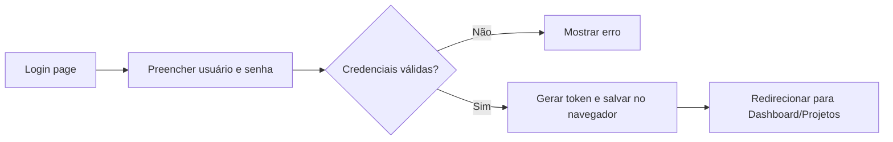
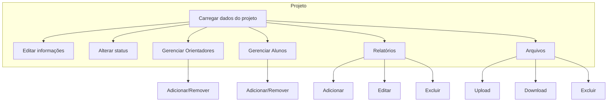
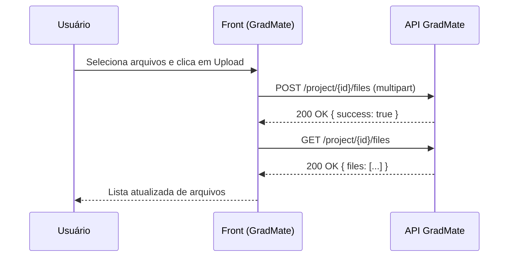

# GradMate — Documentação do Projeto

Este documento consolida visão, arquitetura, módulos, fluxos, endpoints consumidos, padrões e práticas para desenvolvimento e manutenção.

## 1) Visão Geral

- Objetivo: gestão de TCC (projetos), com cadastro de alunos, professores, cursos e acompanhamento via relatórios.
- Stack:
  - Front: PHP (views), CSS, JS (fetch API)
  - API: `link_api_grad_mate` (ex.: http://localhost:5000/) — consumida pelo front
  - Ambiente dev: XAMPP (Apache + PHP), MySQL/MariaDB (não incluso neste repo)
- Organização: views em `views/`, scripts em `assets/js/`, estilos em `css/`, bibliotecas em `assets/libs/`.

## 2) Estrutura de Pastas (resumo)

- `views/` — páginas e parciais PHP (header/sidebar)
  - `views/projeto/` — `projeto.php`, `projetos.php`
  - `views/cursos/` — `cursos.php`
  - `views/alunos/`, `views/professores/`, `views/dashboard/`, etc.
- `assets/js/` — JS por domínio
  - `projetos/projeto.js` — tela de Projeto
  - `curso/curso.js` — tela de Cursos
  - `generics/funcoes_auxiliares.js` — helpers HTTP e toasts
- `css/` — estilos por tela/domínio
- `assets/libs/` — dependências estáticas (bootstrap, fontawesome, etc.)
- `constantes.js` — BASE_URL e `link_api_grad_mate`

## 3) Fluxos Principais

### 3.1 Autenticação (login)
- Página: `index.php`
- Scripts: `assets/js/login.js`
- Token salvo em `localStorage.token` e enviado no header `Authorization` em todas as requisições via helpers.

### 3.2 Projetos
- Página: `views/projeto/projeto.php`
- Script: `assets/js/projetos/projeto.js`
- Funcionalidades:
  - Visualização e edição de informações do projeto (nome, descrição, observação, curso)
  - Mudança de status (Pré-projeto, Qualificação, Defesa, Concluído, Trancado)
  - Gestão de orientadores e alunos com modais e busca
  - Relatórios (adicionar, editar, excluir)
  - Arquivos do Projeto (upload, listagem, download e exclusão)

### 3.3 Cursos
- Página: `views/cursos/cursos.php`
- Script: `assets/js/curso/curso.js`
- Funcionalidades: listagem com paginação, busca, criar/editar, ativar/desativar.

## 4) Integração com API (helpers)

Arquivo: `assets/js/generics/funcoes_auxiliares.js`
- `apiGet(endpoint)` — GET JSON
- `apiPost(endpoint, data)` — POST JSON
- `apiPut(endpoint, data)` — PUT JSON
- `apiDelete(endpoint, data)` — DELETE JSON
- `apiUpload(endpoint, formData)` — POST multipart com autenticação
- `apiDownload(endpoint)` — GET blob, com extração robusta de filename (Content-Disposition, URL ou endpoint)

Headers:
- JSON: `{ 'Content-Type': 'application/json', 'Authorization': token }`
- Upload/Download: `{ 'Authorization': token }`

Config:
- `constantes.js` define `link_api_grad_mate` (ex.: `http://localhost:5000/`).

## 5) Endpoints esperados (referência do front)

Observação: nomes podem variar conforme sua API. Adapte aqui caso necessário.

### Projetos
- GET `project/{id}` → `{ project }`
- PUT `project/{id}` body: `{ name?, description?, observation?, course_id?, status? }`
- POST `project/{id}/teachers` body: `{ teacher_ids: number[] }`
- DELETE `project/{id}/teachers/{teacherId}`
- POST `project/{id}/students` body: `{ student_ids: number[] }`
- DELETE `project/{id}/students/{studentId}`

Relatórios
- POST `project/{id}/reports` body: `{ description, status }`
- PUT/DELETE para editar/excluir (verifique seu backend; o front hoje usa DELETE p/ atualizar, revise conforme sua API)

Arquivos do Projeto
- GET `project/{id}/files` → `{ files: [{ id, name|filename|original_name, size, created_at }] }`
- POST `project/{id}/files` (multipart FormData `files[]`)
- GET `project/{id}/files/{fileId}/download` → blob, com header `Content-Disposition`
- DELETE `project/{id}/files/{fileId}`

### Cursos
- GET `course/?status=all` → `{ courses }`
- GET `course/{id}` → `{ course }`
- POST `course/` body: `{ name, observation? }`
- PUT `course/` body: `{ id, name?, observation? }`
- DELETE `course/` body: `{ id }` (desativar)
- POST `course/active` body: `{ id }` (reativar)

### Professores/Alunos
- GET `teacher` → `{ teachers }`
- GET `student` → `{ students }`

## 6) UI/UX — padrões e componentes

- Layout base: `views/generics/header.php` e `views/generics/sidebar.php`
- Cards, modais e tabelas com classes utilitárias no CSS do projeto
- Buscas com debounce simples (ex.: cursos) ou filtro instantâneo (modais do projeto)
- Toasts: `VanillaToasts` via `showToast(title, message, type)`

## 7) Segurança e Boas Práticas

- Front: escape outputs ao injetar dados em HTML se vierem do backend (quando não controlados)
- API: usar tokens no header `Authorization` (já implementado no helper)
- Upload: validar extensão e tamanho no front (feito) e no backend (recomendado)
- Cache bust: evitar `date('YmdHis')` em produção; usar versão/hashes

## 8) Setup de Desenvolvimento

1. XAMPP rodando Apache e MySQL
2. Colocar `gradmate/` em `htdocs/`
3. Configurar `constantes.js` (BASE_URL, `link_api_grad_mate`)
4. Abrir `http://localhost/gradmate/`

## 9) Convenções de Código

- JS modular por domínio (projetos, curso, etc.)
- Nomes de funções autoexplicativas; usar `async/await` e tratamento de erros com toasts
- Helpers centralizados para HTTP e toasts

## 10) Roadmap Sugerido

- Backend: padronizar endpoints (métodos e payloads) — especialmente em relatórios
- Melhorar build de assets: npm + bundler (Vite/Esbuild)
- Template engine (Twig) ou framework leve (Slim/Lumen/Laravel)
- Paginação/Busca server-side para grandes volumes
- Tests básicos (PHPUnit/JS com Vitest) e CI (GitHub Actions)

## 11) Troubleshooting

- Download sem nome correto: já tratamos múltiplos formatos de `Content-Disposition`; se sua API usar outro header, ajuste `apiDownload()`
- Lista de arquivos vazia: o front trata 404/erro como “Nenhum arquivo enviado”
- Token inválido/expirado: o helper apenas propaga erro; tratar redirecionamento para login conforme necessidade

---
Para aprofundar, inclua exemplos de request/response da sua API e atualize os contratos conforme o backend.
---

# Manual de Uso (Passo a passo)

> Este guia é focado no usuário da aplicação (admin, coordenação, etc.). Mostra como entrar, navegar e executar as tarefas principais no GradMate.

## Acesso e Login

1) Abra no navegador: `http://localhost/gradmate/`
2) Informe seu usuário e senha e clique em “Entrar”.
3) Em caso de erro de autenticação, verifique se o servidor da API está ativo e se suas credenciais estão corretas.

Diagrama (fluxo de login):

## Navegação

- Topo: barra com busca global (visual), notificações e usuário logado.
- Lateral esquerda (sidebar):
  - Home (Dashboard)
  - Projetos
  - Alunos
  - Professores
  - Cursos
  - Administração (Cadastro de Usuário)
  - Sair

## Projetos: visualizar e editar

1) Acesse: Sidebar → Projetos → escolha um projeto na lista (ou acesse por link com `?id_projeto=ID`).
2) Na página do projeto você encontra:
   - Informações do Projeto: nome, descrição, observações e curso (botão Salvar atualiza os dados).
   - Status do Projeto: selecione o status no canto da header (Pré-projeto, Qualificação, Defesa, Concluído, Trancado).
   - Orientadores/Alunos: listas do lado direito, com botões “+” para adicionar.
   - Relatórios: mensagem cronológica, com input para enviar novos e modal para editar/excluir.
   - Arquivos do Projeto: enviar, listar, baixar e excluir arquivos.

Diagrama (gestão de projeto):

### Adicionar Orientadores/Alunos

1) Clique no botão “+” na respectiva seção.
2) No modal, use o campo de busca para filtrar por nome (e matrícula no caso de alunos).
3) Clique para selecionar/desselecionar itens; finalize em “Adicionar Selecionados”.

Observações:
- A lista exibe apenas quem ainda não está vinculado ao projeto.
- Caso a lista esteja muito grande, digite parte do nome para filtrar rapidamente.

### Relatórios

- Novo relatório: use o campo “Digite um novo relatório...” e clique em Enviar (ou Enter).
- Editar/Excluir: clique sobre um relatório para abrir o modal; altere os campos e salve ou exclua.

### Arquivos do Projeto

1) Clique em “Escolher arquivo” e selecione um ou mais arquivos.
2) Clique em “Upload”. Formatos aceitos: pdf, doc/x, xls/x, ppt/x, txt, png, jpg, jpeg (máx. 10MB por arquivo).
3) A lista irá atualizar; use os botões para Download e Excluir.

Diagrama (upload de arquivos):

## Cursos

1) Acesse: Sidebar → Cursos.
2) Buscar: use o campo “Buscar cursos...”.
3) Cadastrar/Editar: “Novo Curso” ou clique em Editar em uma linha.
4) Ativar/Desativar: use o botão de lixeira (o sistema alterna entre ativo e inativo).

## Dicas rápidas (atalhos mentais)

- Enter no campo de novo relatório envia a mensagem.
- Use os botões de “Atualizar” nas listas (Cursos, Arquivos) quando necessário.
- Caso a página aparente travar, verifique se a API está online e se o token não expirou.

## Resolução de Problemas (Usuário)

- Não consigo baixar arquivo: tente novamente; se persistir, verifique a conexão com a API. O sistema já tenta descobrir o nome do arquivo mesmo sem header.
- Lista “vazia” com erro: a tela já mostra “Nenhum arquivo enviado” quando a API não retorna; se o problema persistir, informe a coordenação/ti.
- Não vejo alguém na lista de adição: a pessoa já pode estar vinculada ao projeto.

## FAQ

- Posso enviar qualquer tipo de arquivo? Resposta: somente os formatos listados (pdf/doc/x/xls/x/ppt/x/txt/png/jpg/jpeg).
- Onde vejo o status do projeto? Resposta: no topo da página do projeto, há um seletor de status.
- Consigo desfazer exclusões? Resposta: não. Use com cuidado (especialmente em arquivos e relatórios).
